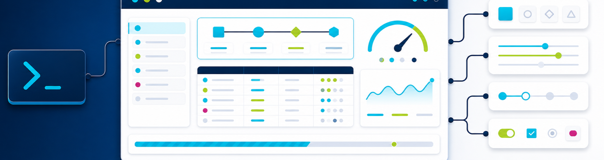

<p align="center">
  
  
</p>

# PoshUI

PoshUI is a dependency-free PowerShell module for composable terminal interfaces. Its 82-command native API covers boxes, tables, layouts, charts, progress, prompts, menus, searchable selection, live regions, trees, code and diff views, themes, status presentation, and structured JSONL logging.

PowerShell 7.6 or later is required. Windows and Linux are exercised in CI. macOS is supported and manually qualified, but this project does not currently have a macOS runner.

## Install

Install from the registered package repository:

```powershell
Install-PSResource PoshUI
Import-Module PoshUI
```

For repository development, use PowerShell 7.6 or later and install the pinned test dependencies:

```powershell
make bootstrap
pwsh ./build.ps1 -Task test
```

The published package is runtime-only. Repository tools, tests, benchmarks, and examples are intentionally excluded.

## Quick start

```powershell
Import-Module PoshUI

Show-PoshUIHeader -Label RELEASE -Title 'Stage deployment'
Show-PoshUIBox -Title Status -Content 'All checks passed' -Style Rounded

$progress = New-PoshUIProgress -Total 4 -Current 3 -Label Deploy
$progress | Show-PoshUIProgress

$table = New-PoshUITable -Style Rounded -Header Service, Status
Add-PoshUITableRow -Table $table -Values api, healthy
Add-PoshUITableRow -Table $table -Values worker, queued
Show-PoshUITable -Table $table
```

Formatting commands return strings for composition or redirection. Display commands write through the shared runtime boundary and honor rich, plain, and off modes.

## Runtime modes

Set `POSH_UI_MODE` before importing the module:

- `rich` enables ANSI styling and terminal control.
- `plain` emits stable text without ANSI sequences.
- `off` suppresses display and logging effects while leaving commands available.
- Unset selects a safe mode from terminal and CI capabilities.

Feature toggles named `POSH_UI_LOAD_<FEATURE>` can disable optional feature modules at import. Import does not publish color, icon, configuration, prompt-history, or loaded-state variables into the process environment.

Use `Get-PoshUIRuntime` to inspect the selected mode and the terminal capabilities behind it:

```powershell
Get-PoshUIRuntime | Format-List
```

## Themes

The default theme is active out of the box. Switch built-in themes at runtime, or create an independent theme and change its semantic or component tokens before activation:

```powershell
Set-PoshUITheme -Name dark

$theme = New-PoshUITheme -Name default
$theme.Component.Box.Border = "`e[38;2;82;214;255m"
$theme | Set-PoshUITheme
```

Theme state belongs to the imported module and never changes process environment variables. Plain and off modes remove all theme control sequences.

## JSONL logging

The local sink writes one UTF-8 JSON object per line. Each event includes `schemaVersion = 1`, an ISO 8601 timestamp, level, message, and optional structured data or exception details.

```powershell
Set-PoshUILogConfiguration `
    -Level Info `
    -FilePath ./logs/application.jsonl `
    -ConsoleOutput $false `
    -MaximumSize 10MB `
    -MaximumFiles 5

Write-PoshUILog -Level Info -Message 'deployment complete' -Data @{
    environment = 'stage'
    version = '26.8.3'
}
```

Writes and rotation are coordinated with a named cross-process mutex derived from the canonical log path. Multiple PowerShell processes can share one sink without interleaving JSON records or racing rotation. Rotation occurs before an accepted event would exceed the configured byte limit. `Clear-PoshUILog` supports `-WhatIf` and confirmation.

`Data` values are serialized verbatim. Do not include passwords, tokens, or other credentials.

## Prompts and privacy

The native prompt family returns typed values and fails safely when input is redirected. Passwords are returned as read-only `SecureString` values. PoshUI does not retain prompt history or persist prompt input.

## Development

```powershell
pwsh ./build.ps1 -Task lint
pwsh ./build.ps1 -Task test
pwsh ./build.ps1 -Task docs-check
pwsh ./build.ps1 -Task version-check
pwsh ./build.ps1 -Task release-plan
```

The command reference is generated from the exact imported module object, explicit manifest inventory, and comment-based help. Automatic release stamping regenerates it before the release commit, preventing the package version and reference from drifting.

See [the documentation navigator](docs/NAVIGATOR.md), [the module guide](powershell/README.md), [the command reference](docs/reference/powershell.md), and [testing guidance](docs/testing/TESTING.md).
